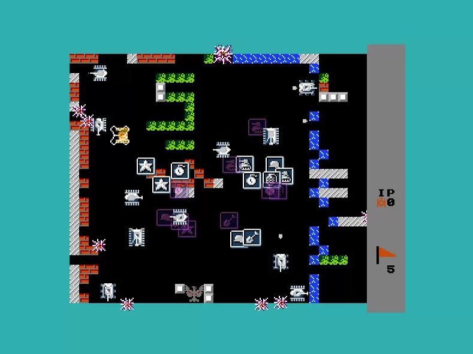

### Описание
Пример простой игры на С++11 с использованием библиотеки SFML.
Сама игра является приближенной реконструкцией классической BattleCity (или Tank 1990).

Ссылка на подробное описание проекта и [документацию Doxygen](https://kozubv.github.io/repository_BattleCity/index.html)

(screenshot)

### Состав
- _BattleCity_ - исходный код на С++
- _bin_ - скомпилированные .dll библиотеки SFML и __BattleCity.exe__ файл программы (версия Debug), 
	которую можно запустить из папки сразу после скачивания репозитория.
- _doc_ - doxyfile генерации документации в Doxygen. Используемые темы офотмления Doxygen совместимы только с ранними версиями. (здесь используется Doxygen 1.8.9)
- _include_ - заголовочные файлы SFML
- _lib_ - .lib файлы библиотеки SFML (только Debug версии для x86)
- _resources_ - текстуры, конфигурационные файлы и карты уровней для игры.

_BattleCity.sln_ - решение VisualStudio2017 сконфигурировано для Debug версии x86 платформы.
Для этой конфигурации решение можно использовать без дополнительных настроек линковки SFML.
